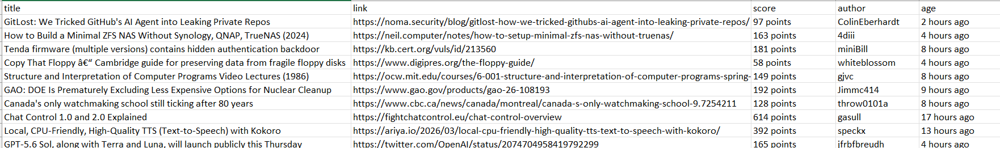

# AI News Monitor

A Python web scraping project that collects the latest articles from Hacker News and exports structured data into a CSV file. This project demonstrates HTML parsing, data extraction, exception handling, and clean Python code organization using Requests and BeautifulSoup.

## Features

- Scrape the latest articles from Hacker News
- Extract article title
- Extract article URL
- Extract score
- Extract author
- Extract publication time
- Export data to CSV
- Custom User-Agent support
- HTTP error handling
- Request timeout handling

## Technologies

- Python 3
- Requests
- BeautifulSoup4
- Pandas

## Project Structure

```
ai-news-monitor/
│
├── scraper.py
├── requirements.txt
├── README.md
├── hn_articles.csv
└── screenshots/
    └── output.png
```

## Installation

Clone this repository

```bash
git clone https://github.com/nasakautsar/ai-news-monitor.git
```

Install dependencies

```bash
pip install -r requirements.txt
```

Run the scraper

```bash
python scraper.py
```

## Sample Output

| Title | Score | Author | Age |
|------|------:|--------|------|
| Example Article | 152 points | username | 2 hours ago |

The complete output is exported as:

```
hn_articles.csv
```

## Screenshot



## Key Learning

Through this project, I learned how to:

- Parse complex HTML structures using BeautifulSoup
- Extract structured information from multiple HTML elements
- Navigate sibling elements using `find_next_sibling()`
- Handle HTTP errors and request timeouts
- Organize Python code into reusable functions
- Export structured data into CSV using Pandas

## Future Improvements

- Add pagination support
- Save data into SQLite
- Export to Excel
- Build a Streamlit dashboard
- Schedule automatic scraping
- Add logging and retry mechanism

## License

This project is created for educational and portfolio purposes.
